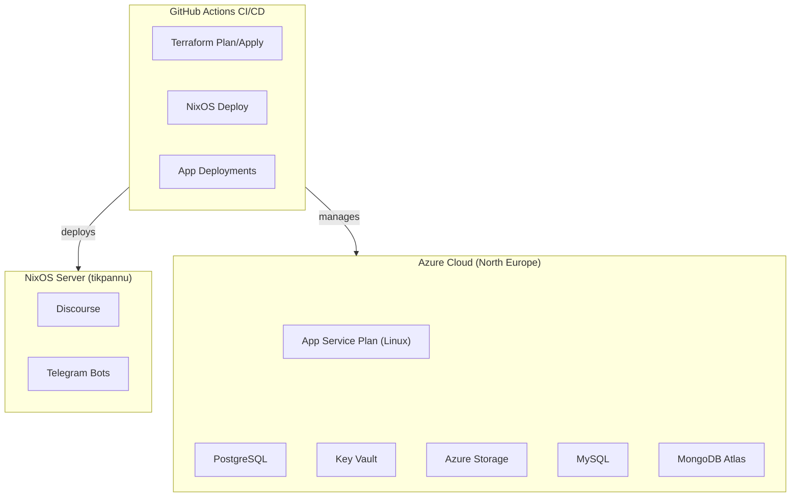
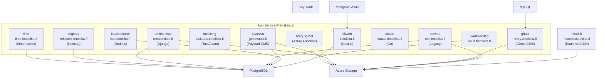
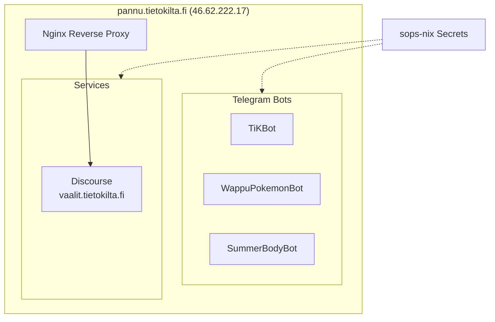
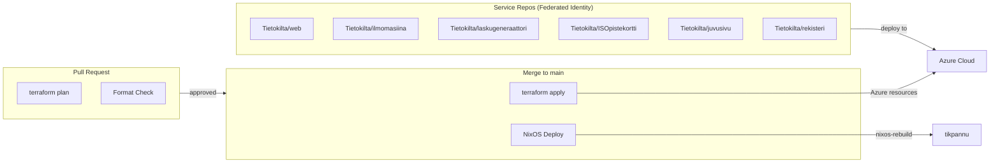

# Architecture

Infrastructure architecture diagrams for Tietokilta ry. Last updated: 2026-02-11.

## System Overview

```mermaid
graph TB
    subgraph Azure["Azure Cloud (North Europe)"]
        ASP["App Service Plan (Linux)"]
        PG[PostgreSQL]
        KV[Key Vault]
        Storage[Azure Storage]
        MySQL[MySQL]
        Mongo[MongoDB Atlas]
    end

    subgraph Tikpannu["NixOS Server (tikpannu)"]
        Discourse
        Bots[Telegram Bots]
    end

    subgraph CI["GitHub Actions CI/CD"]
        TF[Terraform Plan/Apply]
        Nix[NixOS Deploy]
        AppDeploy[App Deployments]
    end

    CI -->|manages| Azure
    CI -->|deploys| Tikpannu
    Azure --- KV
```

## Azure Services

```mermaid
graph TD
    subgraph ASP["App Service Plan (Linux)"]
        tikweb["tikweb<br/>tietokilta.fi<br/>(Next.js)"]
        ilmo["ilmo<br/>ilmo.tietokilta.fi<br/>(Ilmomasiina)"]
        registry["registry<br/>rekisteri.tietokilta.fi<br/>(Node.js)"]
        tenttiarkisto["tenttiarkisto<br/>tenttiarkisto.fi<br/>(Django)"]
        invoicing["invoicing<br/>laskutus.tietokilta.fi<br/>(Rust/Axum)"]
        ghost["ghost<br/>rekry.tietokilta.fi<br/>(Ghost CMS)"]
        rekry_bot["rekry-tg-bot<br/>(Azure Function)"]
        vaultwarden["vaultwarden<br/>vault.tietokilta.fi"]
        status["status<br/>status.tietokilta.fi<br/>(Go)"]
        isopistekortti["isopistekortti<br/>iso.tietokilta.fi<br/>(Node.js)"]
        juvusivu["juvusivu<br/>juhlavuosi.fi<br/>(Payload CMS)"]
        oldweb["oldweb<br/>old.tietokilta.fi<br/>(Legacy)"]
    end

    histotik["histotik<br/>histotik.tietokilta.fi<br/>(Static via CDN)"]

    PG[PostgreSQL]
    KV[Key Vault]
    Storage[Azure Storage]
    Mongo[MongoDB Atlas]
    MySQL[MySQL]

    Mongo --> tikweb
    MySQL --> ghost

    ilmo & registry & tenttiarkisto & oldweb --> PG
    juvusivu & isopistekortti & vaultwarden --> PG

    tikweb & juvusivu & tenttiarkisto --> Storage
    ghost & vaultwarden & oldweb --> Storage
    histotik --> Storage
```

## NixOS Server (tikpannu)

```mermaid
graph TD
    subgraph Tikpannu["pannu.tietokilta.fi (46.62.222.17)"]
        Nginx[Nginx Reverse Proxy]

        subgraph Services
            Discourse["Discourse<br/>vaalit.tietokilta.fi"]
        end

        subgraph TikBots["Telegram Bots"]
            TiKBot[TiKBot]
            Wappu[WappuPokemonBot]
            Summer[SummerBodyBot]
        end
    end

    Nginx --> Discourse
    SOPS[sops-nix Secrets] -.-> Services
    SOPS -.-> TikBots
```

## CI/CD Pipelines

```mermaid
graph LR
    subgraph PR["Pull Request"]
        Plan[terraform plan]
        Format[Format Check]
    end

    subgraph Main["Merge to main"]
        Apply[terraform apply]
        Deploy[NixOS Deploy]
    end

    subgraph Apps["Service Repos (Federated Identity)"]
        Web[Tietokilta/web]
        Ilmo[Tietokilta/ilmomasiina]
        Lasku[Tietokilta/laskugeneraattori]
        Iso[Tietokilta/ISOpistekortti]
        Juvu[Tietokilta/juvusivu]
        Reg[Tietokilta/rekisteri]
    end

    PR -->|approved| Main
    Apply -->|Azure resources| Azure[Azure Cloud]
    Deploy -->|nixos-rebuild| Pannu[tikpannu]
    Apps -->|deploy to| Azure
```
